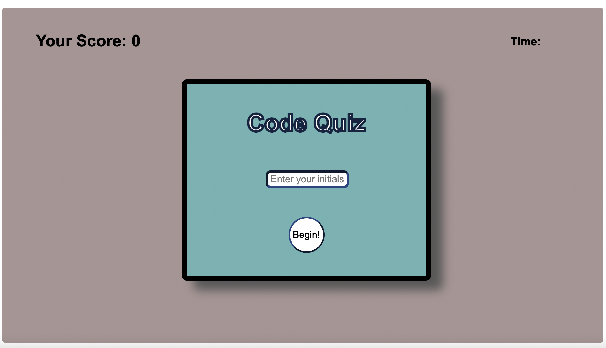
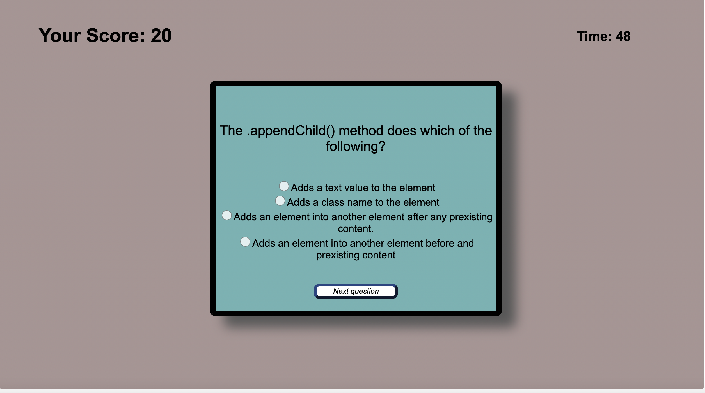
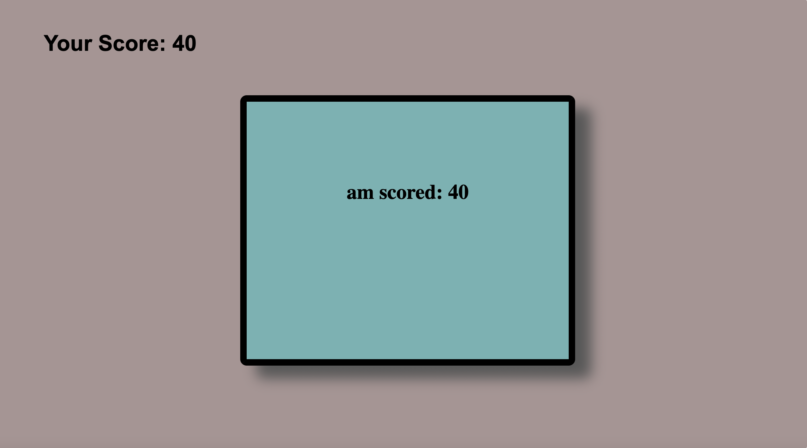

# codequiz
This quiz tests the user on JavaScript and DOM manipulation knowledge. 
There are a total of seven multiple choice questions. The enter is prompted to 
enter their initials and once the user selects the begin button a time of 
60 seconds starts. If the user gets a question wrong, 10 seconds come off the clock. 
Every answer the user gets correct rewards them 20 points. 

As soon as the game is over, the score shows under that players initials. 
Those initials and score are saved as soon as the game is over. 

 "Starting page")
 "Questions")
 "Results page")
